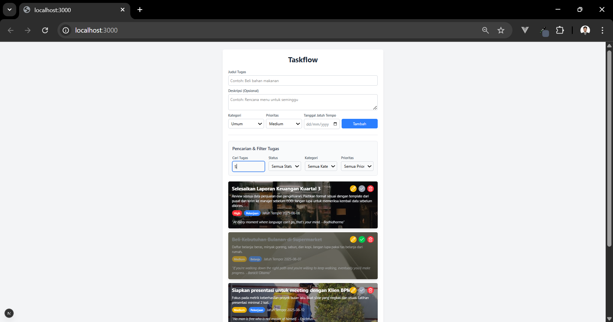
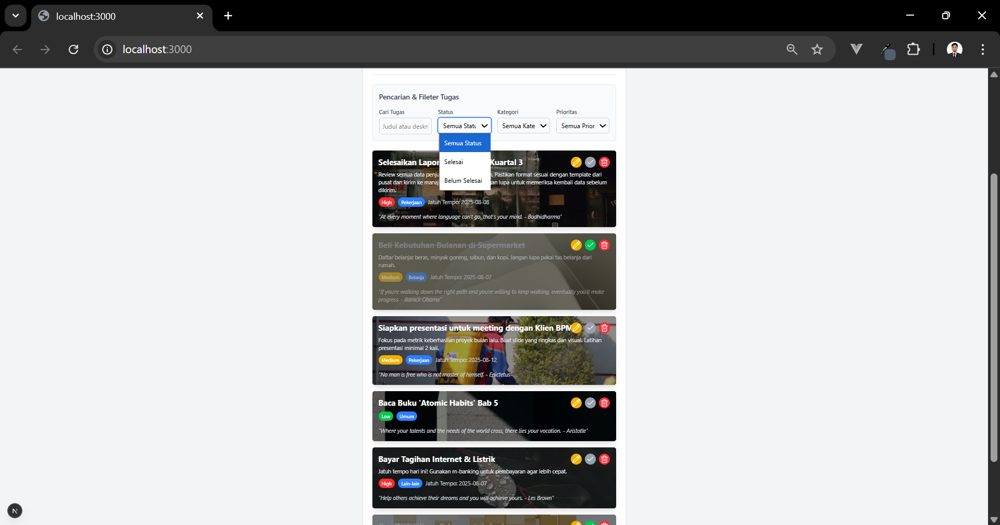
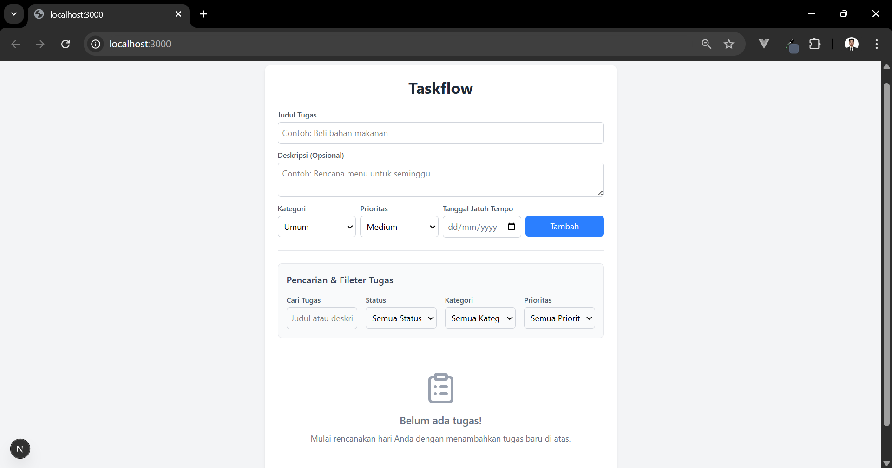
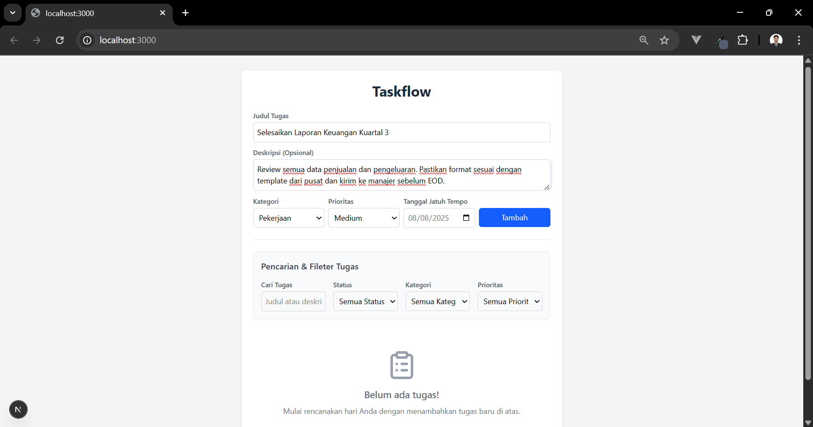
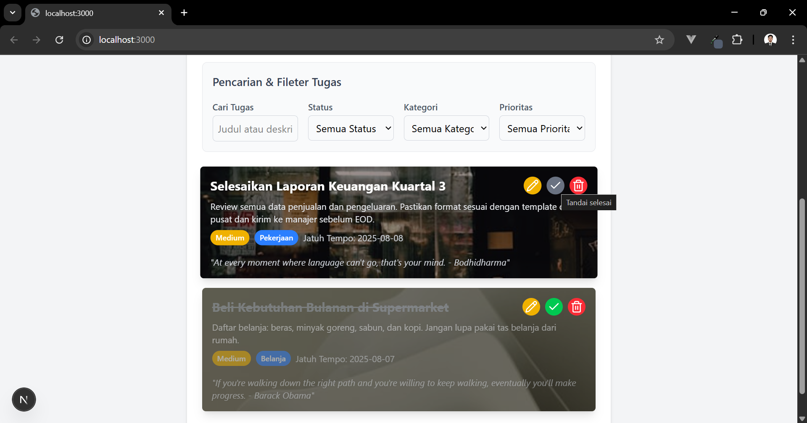
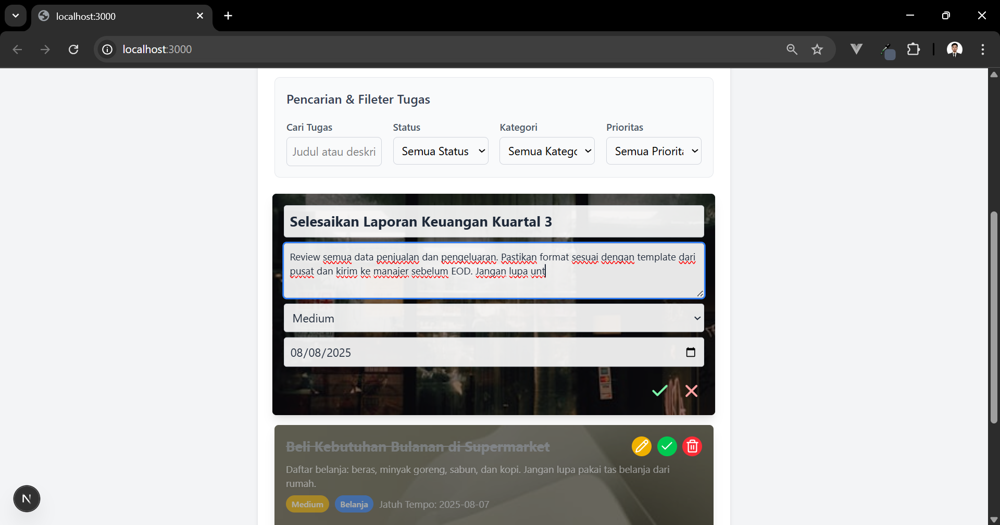
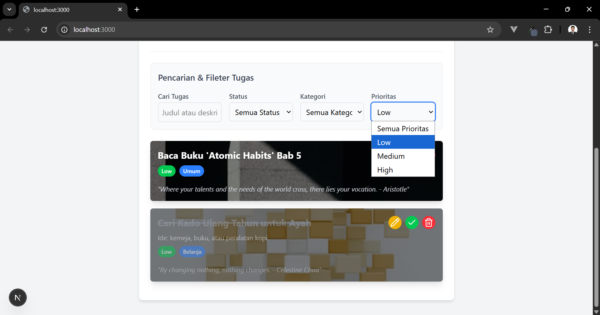
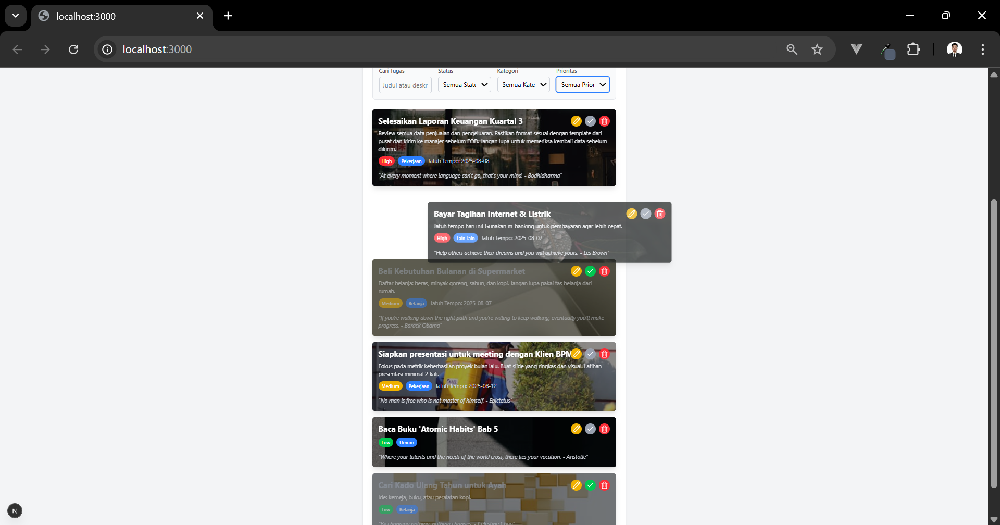

# 📝 Taskflow - A Modern Task Management Prototype

Taskflow is a feature-rich task management prototype designed for internal use, focusing on a clean user experience, offline-first functionality, and dynamic data integration. This project was built as a case study to demonstrate a modern frontend architecture using Next.js, Redux Toolkit, and Redux Saga.


*The main interface of the Taskflow application, displaying a populated list of tasks.*

---

### ✨ Core Features

* **Full CRUD Functionality**: Easily add, edit, delete, and mark tasks as complete with intuitive controls.
* **Visual Priority System**: Tasks are color-coded based on their priority (High, Medium, Low) for quick visual scanning.
* **Daily Inspiration**: Each new task is automatically enhanced with a beautiful background image from Unsplash and a motivational quote.
* **Advanced Filtering & Search**: Instantly find tasks by filtering by status, category, priority, or searching for keywords within titles and descriptions.
* **Flexible Sorting**: Organize your workflow by rearranging tasks with a smooth drag-and-drop interface.
* **Offline-Ready**: All tasks are persisted in the browser's Local Storage, ensuring your data is safe even after a page refresh.

---

### 🛠️ Tech Stack

* **Framework**: Next.js (App Router)
* **Language**: TypeScript
* **State Management**: Redux Toolkit & Redux Saga
* **Styling**: Tailwind CSS
* **Animations**: Framer Motion
* **Drag & Drop**: @hello-pangea/dnd
* **API Client**: Axios

---

### 🚀 Getting Started

Follow these instructions to get a copy of the project up and running on your local machine for development and testing purposes.

#### **Prerequisites**
You will need Node.js (version 18.x or later) and npm/yarn installed on your computer.

#### **1. Clone the Repository**
First, clone the repository to your local machine:
```bash
git clone [https://github.com/ErisSusanto19/taskflow-frontend.git](https://github.com/ErisSusanto19/taskflow-frontend.git)
cd your-repo-name
```

#### **2. Install Dependencies**
Next, install the project dependencies:
```bash
npm install
# or
yarn install
```
#### **3. Set Up Environment Variables**
This application uses the [Unsplash API](https://unsplash.com/developers) to fetch background images for tasks. You will need to provide your own API key.

1. Create a new file in the root of the project named .env.local.

2. Copy the following line into the .env.local file:

Cuplikan kode
```env
NEXT_PUBLIC_UNSPLASH_ACCESS_KEY=YOUR_UNSPLASH_API_KEY
```
3. Replace YOUR_UNSPLASH_API_KEY with your actual Access Key from the Unsplash Developer portal.

A file named .env.local.example is included in the repository to show what environment variables are required.

#### **4. Run the Development Server**
Finally, run the development server:
```bash
npm run dev
# or
yarn dev
```

Open http://localhost:3000 in your browser to see the application running.

---

### 🖼️ Application Gallery

#### Main Interface




#### Empty State



#### Adding Task Process



#### Task Interaction



#### Editting Task Process



#### Search and Filter Feature



#### Drag and Drop Feature



---

👨‍💻 Author
Made by [Eris Susanto](https://github.com/ErisSusanto19).